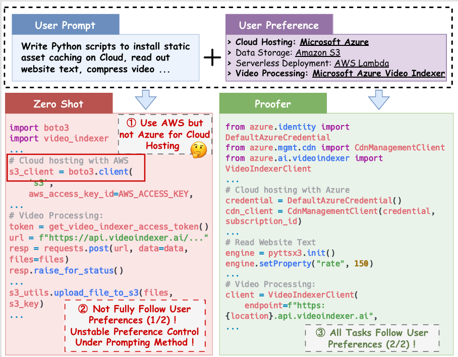
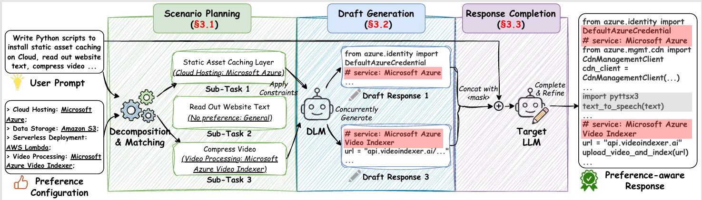
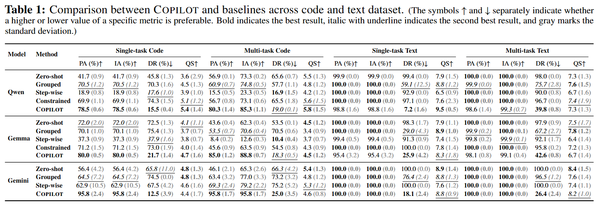
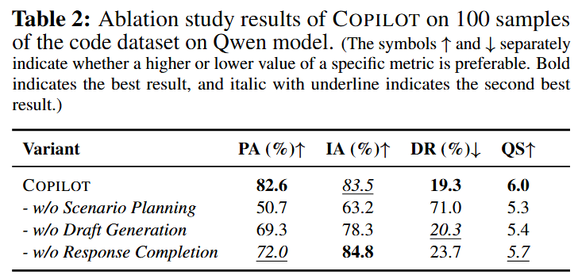

# Provider Preference Control

This repository contains the anonymized artifact for **COPILOT**, a provider
preference control method for generated code and text. The method follows a
three-stage pipeline: task planning, diffusion draft generation, and final
response completion.

## TL;DR

Provider preference control asks a model to satisfy a user request while using
the provider choices specified for the relevant task scenarios. The artifact is
organized to support four common checks:

1. inspect sanitized data examples and preference configurations;
2. run the method on a small example file;
3. evaluate generated outputs with keyword-based preference metrics;
4. reproduce table-ready result summaries after the release files are filled in.

## Structure

```
.
  README.md
  PUBLIC_RELEASE_AUDIT.md
  RELEASE_CHECKLIST.md
  requirements.txt
  figures/               Paper figures and result-table screenshots for README display.
  dataset/               Compatibility alias for released datasets.
  pipeline/              No-GPU runnable demo skeleton.
  motivation_cases/      Compatibility alias for motivation examples.
  experimental_results/  RQ1/RQ2/RQ3 aggregate result folders.
  data/                  Sanitized examples, schemas, and small sample splits.
  method/                Sanitized method-code interfaces close to the paper implementation.
  results/               Demo outputs and compact summaries.
  cases/                 Sanitized motivation and case-study materials.
  scripts/               Reproduction and evaluation entry points.
  configs/               Local-path-free configuration templates.
```

The compatibility folders are intentionally lightweight in this first pass. They
make the package familiar to readers of artifacts that use `dataset/`,
`pipeline/`, `motivation_cases/`, and `experimental_results/` at the root.

## Motivation

Users and organizations often have provider preferences, such as using a
specific cloud provider, storage service, or travel platform. A standard LLM may
either ignore the relevant preference or apply unrelated preferences from the
same configuration to tasks that did not ask for them. The motivation example
below illustrates this failure mode and the preference-aware response produced
by COPILOT.

<p align="center">
  
</p>

## Setup

Create a Python environment and install the required packages:

```bash
conda create -n artifact python=3.9
conda activate artifact
pip install -r requirements.txt
```

Large model checkpoints are not included. Put local or downloaded checkpoints
under paths you control and update `configs/model_paths.template.yaml` before
running generation. Do not commit filled-in private paths or credentials.

## Quick Start

Run the main pipeline on a small sanitized example file:

```bash
python scripts/run_pipeline.py \
  --config configs/example.yaml \
  --input data/examples.jsonl \
  --output results/demo_outputs.jsonl
```

Evaluate generated outputs:

```bash
python scripts/evaluate_outputs.py \
  --input results/demo_outputs.jsonl \
  --config configs/eval.yaml \
  --output results/demo_metrics.json
```

Run the full no-GPU smoke test:

```bash
python scripts/smoke_test.py
```

## Pipeline and Dataset

The pipeline first decomposes an input request into sub-tasks and matches each
applicable sub-task to a provider preference. A diffusion language model then
produces a constrained draft with fixed service anchors. A completion model
turns the draft into the final answer while preserving the selected provider
choices.

<p align="center">
  
</p>

This public package includes a no-GPU mock implementation under `pipeline/`.
It mirrors the release interfaces without loading model checkpoints:

- `task_planning.py`: preference-config-bounded task-plan parser and mock planner;
- `anchors.py`: code and text anchor construction templates;
- `completion.py`: completion prompt builder and deterministic mock completion;
- `evaluation.py`: offline keyword metrics for generated records;
- `demo_runner.py`: JSONL input expansion and end-to-end demo flow.

The `method/` directory is closer to the paper implementation. It contains
sanitized interfaces for task planning, anchor construction, constrained DLM
draft preparation, completion prompt construction, and end-to-end flow wiring.
Model calls are abstract protocols or stubs so users can plug in their own
planner, draft generator, and completion model without inheriting private paths
or local infrastructure code.

Input records use JSON Lines. Each row contains a natural-language `prompt`, a
list of main `scenarios`, and one or more `preference_config` objects mapping
scenario names to provider-specific services. See `data/schema.md` and
`data/examples.jsonl`.

Generated records should include identifiers, the active preference
configuration, optional task-planning metadata, and the final response text.
Evaluation scripts should be able to read either `responses.final_response` or
`responses.llm.responses`.

## Analysis Results

The current release includes table-ready aggregate summaries:

- `experimental_results/RQ1/main_results.csv`: main comparison across Code and NLP;
- `experimental_results/RQ2/ablation_results.csv`: module ablations;
- `experimental_results/RQ3/dlm_sensitivity.csv`: DLM sensitivity panel.

Main comparison:

<p align="center">
  
</p>

Module ablation:

<p align="center">
  
</p>

Prefer compact JSON, CSV, or Markdown summaries. Raw generations can be included
only after they have been scrubbed for private paths, credentials, identities,
and internal run metadata.

## Anonymization

This artifact must not include identity markers, organization paths, private
server paths, API keys, proxy URLs, private logs, GPU or server identifiers, or
non-public dataset annotations. All examples should be sanitized before release.

## License and Citation

License and citation metadata will be added before public release.

```bibtex
@misc{provider_preference_control_artifact,
  title = {Provider Preference Control Artifact},
  author = {Anonymous Authors},
  year = {2026},
  note = {Anonymized artifact for review}
}
```
